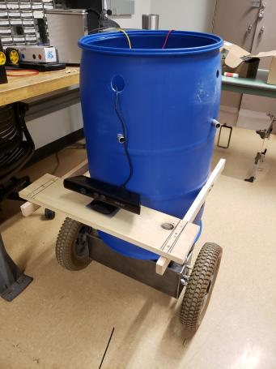
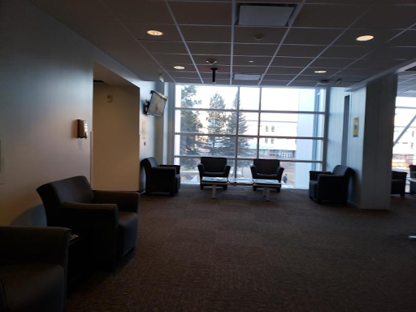
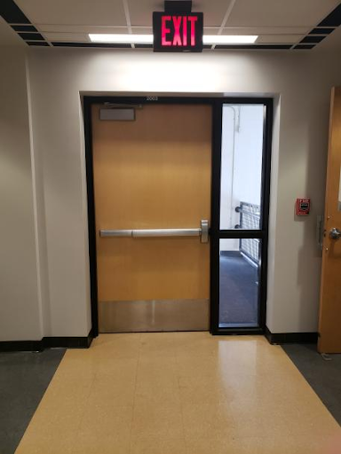

# PoseidonWayfinding

This was from our capstone project, the Thirty Gallon Robot, from August 2021 - May 2022

The purpose of our project was to create an autonomous movement and obstacle avoidance module for the provided thirty gallon robot.

The minimum viable product of this robot was to have it autonomously move through Northern Arizona Univesity's Engineer Building while avoiding obstacles. It needed to do this in the long hallway of the second floor of the building. When the robot reached one end of the hallway it would recognize it and turn around. Upon reaching the second end of the hallway or the starting position, the robot will stop and the program would end.

**North End of the Hallway, the Lobby Area**

**South End of the Hallway, the Exit Door**

To do this we utilized a few things:
- Raspberry Pi 4B for the main robot controller
- Xbox 360 Kinect Sensor for obstacle avoidance
- 3 HC-SR04 Sonar Sensors also for obstacle avoidance
- Raspberry Pi Camera Module for hallway detection
- Deep Convolutional Neural Network also for hallway detection
